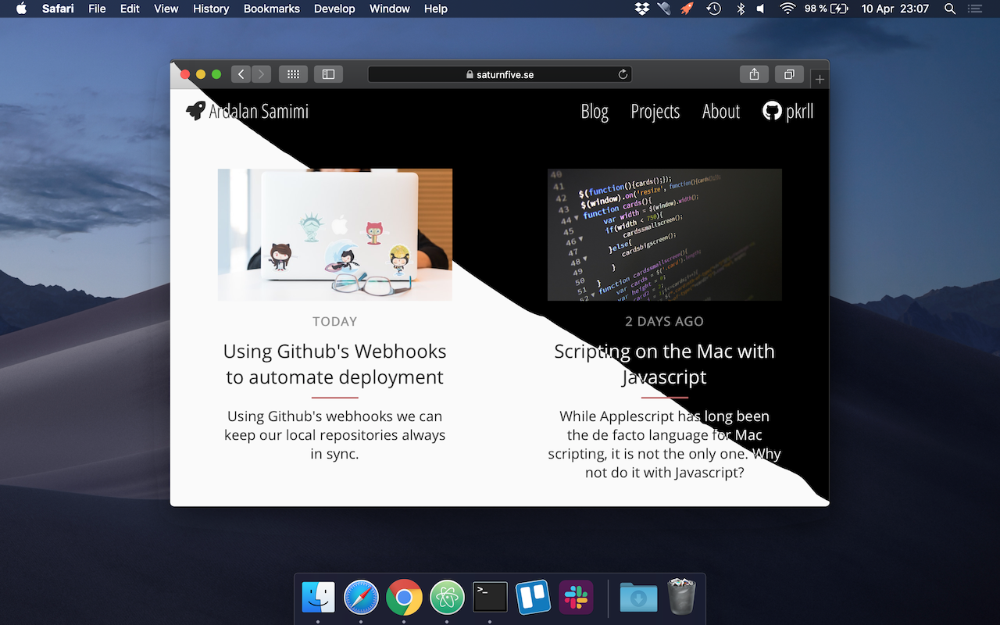

# Enable Dark Mode for the Web



###### Keywords: macOS, web development, CSS, Mojave, Dark Mode

Last year, Apple introduced support for the ``prefers-color-scheme`` media query with the Safari Technology Preview Release 68, making it possible to add a dark mode styling to a website. This enables web developers to adapt their designs to the macOS Mojave Dark Mode feature.

With the release of macOS Mojave 10.14.4 a couple of weeks ago, this feature is now included in Safari. And it's super easy to enable!

#### Enabling dark appearance

Dark Mode is a relatively new feature, introduced in macOS Mojave. If you're not familiar with it, you can switch between a light and a dark theme in ``System Preferences > General``. When changing appearance, apps with support for Dark Mode, along with native apps, the Dock and the menu bar, will follow suite and adjust their color schemes.

To enable this feature on the web, we only need to add the media query ``prefers-color-scheme``:

```css
@media (prefers-color-scheme: dark) {

  body {
    background: rgb(0, 0, 0);
    color:      rgb(250, 250, 250);
  }

}
```

This will change the ``background`` and ``color`` properties of the ``body`` element on the page only when the user has Dark Mode enabled.

It is worth noting that this feature is as of now only supported in macOS Mojave 10.14.4 and Safari 12.1, although Firefox will soon support it too, with the release of Firefox 67 in May.

You can read more about the new features introduced with Safari 12.1 on <a href="https://webkit.org/blog/8718/new-webkit-features-in-safari-12-1/" target="_blank">__Webkits blog__</a>.
