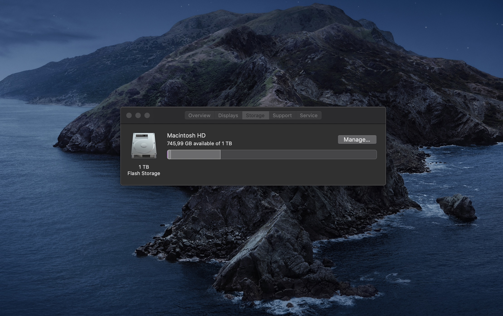
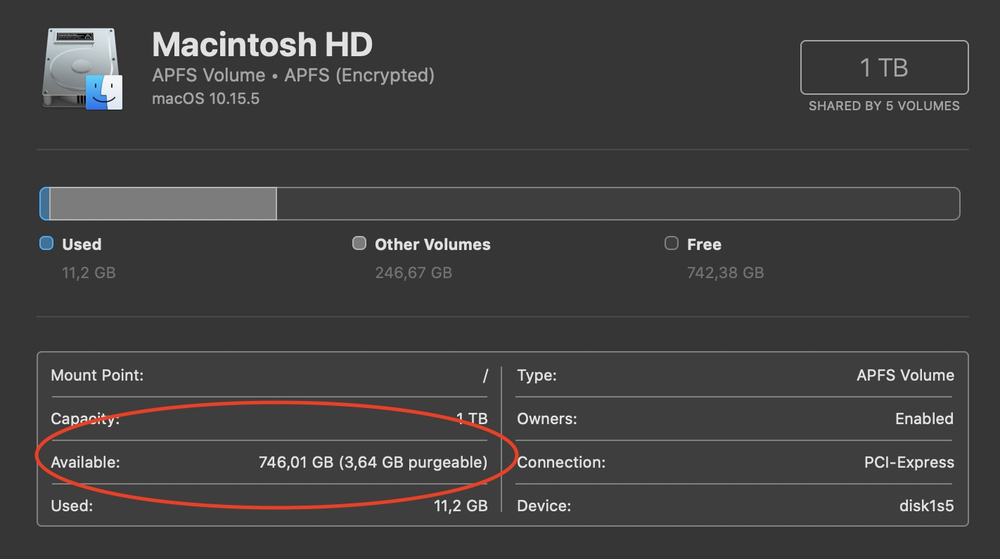

# Not Enough Space for Xcode? Here's How To Fix It

###### Keywords: macOS, xcode

Stop me if you've had this happen before. You hear about a new Xcode release and hurry on to [xcodereleases.com](https://xcodereleases.com) to download it to your machine, eager to try out all the cool, new features Apple added to everyones favourite IDE. Thirty minutes later, when the ~10GB download has finished, you try to extract the archive, only the be met with an error:

> There is not enough disk space available to install the product.

OK, you say. The OS needs in and of itself at least 10GB just to be able to operate, the download itself needs some space to unpack the files and then let's not forget some additional space for the actual installation. All in all, you figure, you might need 30-50GB of free space.

Fair enough.

You start the yearly cleaning routine. Clean out the cache folder, remove old apps you no longer use and maybe even push some images to the cloud. There. You're now left with a whooping 180GB of free space (according to Finder)! That should be enough, right?

You attempt unpack the Xcode archive again. But again, the OS stops you:

> There is not enough disk space available to install the product.

Weird. After double and triple checking the disk space and rebooting the machine countless times, you're ready to migrate to Windows. But hold on. There is a solution.

#### Purgeable space vs free space

The underlying issue is that Finder is lying to you. It might claim that you have 180GB of free space, but in reality, it is much, much less.

In macOS Sierra, Apple introduced a new category of storage space, called purgeable space. This is a special storage where the Mac keeps deleted files that it thinks you might be needing again. For example, images and documents that have been synced to iCloud, or even local Time Machine snapshots. You can't delete these "deleted" files yourself. Instead, the system will purge the data when needed, for example, if an application requests some space.

You can check how much purgeable space you have in the Disk Utility app.

The "free" space reported by Finder is in reality the amount of available space - purgeable data plus free space.

#### So, how do I free purgeable space?

There are third party-software that can help you do just that. But another, easier (for me at least) way is to just use the command-line utility ``dd`` to basically create a large enough file to force the Mac to clear some space for you.

**Here's how to do it:**

1. Open the Terminal and navigate to your home folder or some other suitable place.

2. Type in the following command: ``dd if=/dev/zero of=/Users/<USERNAME>/file bs=15m``.
  - This tool will create the file ``file`` with output from ``/dev/zero``.
  - Be sure to replace ``<USERNAME>`` with your actual username.

3. Wait a few minutes (let the file grow to at least 5GB), and then kill the process by hitting ``ctrl+c`` in the Terminal.

4. Open Finder and go to the file you just created in your home folder.

5. Duplicate the file a bunch of times by selecting it and hitting ``CMD+D``.

6. Once enough disk space has been claimed, the system should start to remove purgeable data.

7. You are done!

If you check Disk Utility again, the amount of purgeable space should be significantly lower, and it should be possible to extract the Xcode download.

Happy coding!
