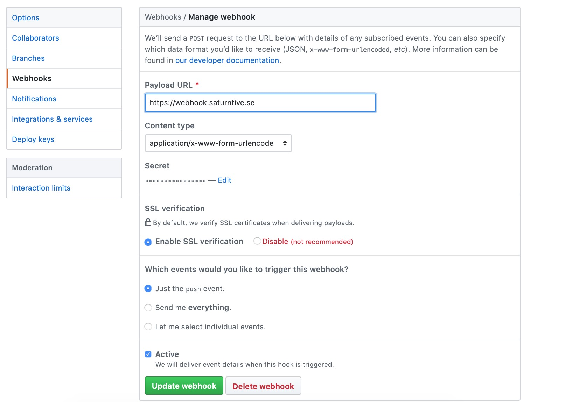
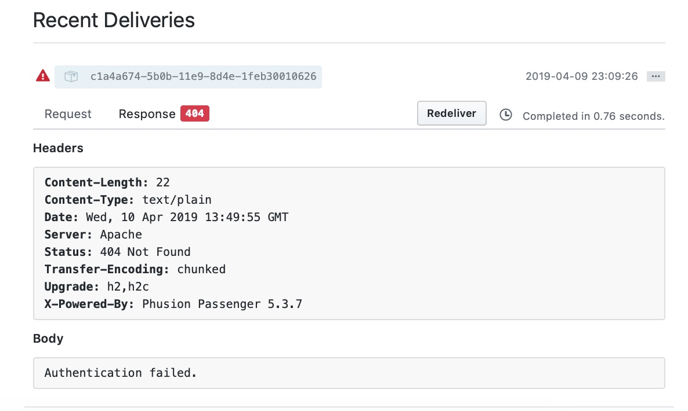
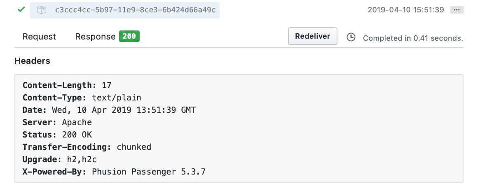

# Using Github's Webhooks to automate deployment


###### Keywords: Github, Node, Javascript, Webhooks

In a previous post, I described my new setup for the blog. In short, I used a repository on Github (the <a href="https://github.com/pkrll/furry-potato" target="_blank">__furry-potato__</a> repo) as storage for the posts, fetching them directly from Github when a visitor decides to read it.

This was, however, only a temporary solution, as it's not really all that efficient to fetch Markdown files and images from an external source each time a visitor clicks on a post. Not only does it produce unnecessary traffic, it's also slower.

#### Caching files

A better solution is to cache the files locally and serve the readers those files, and only update the local cache when the external source (the Github repository) changes.

For this, we can use Github's webhooks service.

Webhooks has steadily been growing in popularity and can be found in a variety of apps and services today, like **Discord**, **CircleCI**, **Wordpress** or **Github**.

#### Webhooks as a notification system

Basically, it's an HTTP callback, triggered by some event or action. A source server will notify another, *listening* server about some event that has occurred, whether it is a new message on Discord or a push event on Github, by making an HTTP request.

For Github, a common usage for webhooks is to automate deployment of apps and services. For example, when someone pushes to the master branch, Github can notify our server, which in turn pulls the latest changes from the repository and re-deploys the app automatically.

Of course, there are a lot of other events that we can subscribe to, for instance, whenever a new issue is created or a new release is published, allowing us to create very specific integrations and services.

For my blog, I chose the simple approach of only listening to push events.

Instead of fetching a post directly from Github, the site now looks in a local folder, that's a copy of the <a href="https://github.com/pkrll/furry-potato" target="_blank">__furry-potato__</a> repository. Every time I push to the remote repository, my server will pull the changes, keeping the local repository in sync.

#### Getting started with webhooks

To get started with webhooks, you first need a web server reachable from the interwebs. This will be the listening server that the source makes a request to. In my case, it's the same server serving my site. Second, we need to write a simple server-side application, handling the requests. In this guide, we'll be using **NodeJS**.

Start by creating the file ``server.js`` in the root folder of the project, and set up a simple server:

```js
const http = require('http');

http.createServer((req, res) => {
	res.writeHead(200, {"Content-Type": "text/html"});
	res.write("Hello, World!");
	res.end();
}).listen(3000);
```

For those not familiar with **NodeJS** or the **HTTP** module, the above code basically creates a server that listens on port 3000. Every time someone access the server, the visitor will be greeted with the text ``Hello, World!``. The ``writeHead()`` method sets the HTTP header for the response, in this case a ``200`` status code and the content-type set to ``text/html``.

Try it out by running ``node server.js`` in the terminal and then accessing localhost on port 3000.

#### A bit more about Github's webhooks

As mentioned, Github allows subscription to a bunch of different events (see <a href="https://developer.github.com/webhooks/#events" target="_blank">__here__</a> for a complete list). Each event has a different format for the payload it sends to the listening server. This payload includes information such as which event was triggered, by whom and more specific data.

We can even set a secret password for our hooks, making sure only authorized calls are made.

The HTTP requests made will contain three special headers:

* ``X-GitHub-Event``: The name of the event.
* ``X-GitHub-Delivery``: A unique ID for the request.
* ``X-Hub-Signature``: The HMAC hex digest of the response body (which will be sent only if we set up the secret key).

In this post, we're only going to check the ``X-Hub-Signature`` header, as we will only subscribe to ``push`` events.

#### Handling the hook

Let's go back to ``server.js``, and remove the three lines in the callback function of the ``createServer`` method, and instead listen on the ``data`` and ``end`` event of the ``request`` object.

```js
const http = require('http');

http.createServer((req, res) => {
	let message = "Authentication failed.";
	let status  = 404;
	let body = "";

	req.on("data", chunk => body += chunk);
	req.on("end",     () => {
		// Retrieve the signature from the header
		const signature = req.headers['x-hub-signature'];
		// Verify that the signature is the same
		if (verifySignature(signature, body)) {
			// Here we will do more stuff later
			message = "Request received!";
			status  = 200;
		}

		res.writeHead(status, { "Content-Type": "text/plain" });
		res.write(message);
		res.end();
	});
}).listen(3000);
```

Ignoring the variable declarations, the first line simply appends any data sent to the body variable. The second line sets up the ``request`` object to listen to the ``end`` event, which fires when there is no more data to consume. This means we are ready to process the request.

We do this by first verifying that the requests is authentic. The ``verifySignature``, which we will write in a moment, checks that the ``SHA1 HMAC`` signature found in the ``X-Hub-Signature`` header matches our secret key. If it does, we set the ``status code`` to 200, and send a response back. On unauthorized call, the callee will get a 404 response.

#### Verifying the signature

To verify the signature, we first need to choose a secret key. This key should not be visible to anyone except you.

```js
const crypto = require('crypto');
const secret = "..."; // Change this

const verifySignature = (signature, body) => {
	// Compare the signatures
	return signature == buildSignature(body);
};

const buildSignature = (body) => {
	// Create a signature using the payload and the secret key
	const signature = crypto.createHmac('sha1', secret)
                         .update(body.toString())
                         .digest('hex');
	return "sha1=" + signature;
};
```

Here, we use the ``crypto`` module, to generate a ``SHA1 HMAC`` signature using the secret key and the payload received (``body``) and finally just comparing the two signatures.

Now, we are ready to actually perform an action whenever an authenticated request is made.

In my case, I just want to pull the latest changes from the repository. For that, I will use the ``execSync`` method of the ``child_process`` module.

```js
const http = require('http');
// Import the exec method
const exec = require('child_process').execSync;
const path = "/path/to/the/local/repo";

http.createServer((req, res) => {
	let message = "Authentication failed.";
	let status  = 404;
	let body = "";

	req.on("data", chunk => body += chunk);
	req.on("end",     () => {
		const signature = req.headers['x-hub-signature'];
		if (verifySignature(signature, body)) {
			// Perform the action:
			exec("cd " + path + " && git pull", {
				timeout: 10000
			});
			message = "Request received!";
			status  = 200;
		}

		res.writeHead(status, { "Content-Type": "text/plain" });
		res.write(message);
		res.end();
	});
}).listen(3000);
```

The ``exec`` call will ``cd`` in to the folder where my Github repository is set up, and perform ``git pull``. This is a synchronized call, as we'd want to wait for it to finish.

Obviously, the above code is not truly safe. We would need to check the return code from the ``exec`` call to make sure that the command was performed successfully, for example by enclosing it in a ``try-catch`` clause. However, I'll leave that as an exercise for the reader.

#### Setting up webhooks on Github

The only thing left now is to set up the webhook on Github. Navigate to the repository you want to subscribe to, click on **Settings**  and **Webhooks**. There, you can add, remove or edit webhooks. Click **Add webhook** and fill in the necessary fields:



Don't forget to add the same secret key as the one used in script, otherwise you will get the following response:



When you're ready, click the **Add webhook** button to create it. This will send out a first request to the listening server, and if everything was set up correctly, you should get a response similar to this:



You can download or checkout the entire code on <a href="https://github.com/pkrll/jubilant-spork" target="_blank">__Github__</a>.

#### Next steps

This was a pretty simple setup, but we can do a lot more complex and cool stuff. Please see the <a href="https://developer.github.com/webhooks/" target="_blank">__documentation__</a> for more information!

*Cover photo by <a href="https://unsplash.com/photos/eygpU6KfOBk" target="_blank">Pankaj Patel</a> on <a href="https://unsplash.com/" target="_blank">
Unsplash</a>.*
